# 🩺 Informe de Evidencias — Backend SeñaVida

<p align="center">
  
  
  
  
  
  
  
</p>

> Evidencia completa de funcionamiento del backend de **SeñaVida**, probada endpoint por endpoint con **Postman** y **Swagger UI**, y verificada a nivel de base de datos con **Tinker**. Este documento acompaña la entrega del **EVA2** y demuestra, con capturas reales (no simuladas), que el proyecto cumple cada indicador de la rúbrica.
>
> **Alcance ampliado.** Las secciones 1–5 corresponden a la entrega original del EVA2. Las secciones 6–10 documentan el trabajo posterior de la **Fase 4**: documentación interactiva con Swagger, CRUD administrativo completo, el **Hito 1** (modelo de Paciente) y el **Hito 2** (Código Temporal de Atención).

| | |
|---|---|
| 👩‍💻 **Estudiante** | Greudy Inoa |
| 🎓 **Institución** | Instituto Profesional San Sebastián |
| 📦 **Proyecto** | SeñaVida — Backend API REST |
| 🔗 **Repositorio** | [`GreudyInoa/senavida-backend-eva2`](https://github.com/GreudyInoa/senavida-backend-eva2) |
| ⚙️ **Stack** | Laravel 13 · PHP 8.4 · PostgreSQL · Laravel Sanctum |
| 📅 **Entrega EVA2** | 17 de agosto de 2026 |
| 🔄 **Última actualización** | 24 de agosto de 2026 — Fase 4, Hitos 1 y 2 |

---

## 📑 Índice

**Entrega EVA2**

1. [¿Qué es este documento y por qué existe?](#1-qué-es-este-documento-y-por-qué-existe)
2. [Configuración del entorno y la base de datos](#2-configuración-del-entorno-y-la-base-de-datos)
3. [Evidencias de Autenticación](#3-evidencias-de-autenticación)
4. [Evidencias de Registro de Usuarios y Cifrado](#4-evidencias-de-registro-de-usuarios-y-cifrado)
5. [Evidencias de Catálogos](#5-evidencias-de-catálogos)
   - 5.1–5.3 Creación de Organización, Centros y Unidades
   - 5.4 Control de roles (RBAC) · 5.5–5.7 Listados · 5.8 Multitenancy

**Fase 4 — trabajo posterior**

6. [Documentación interactiva con Swagger](#6-documentación-interactiva-con-swagger)
   - 6.1 La interfaz · 6.2 Autenticación · 6.3 Grupos de endpoints
   - 6.4–6.6 Ejecución real desde el navegador
7. [CRUD administrativo completo](#7-crud-administrativo-completo)
   - 7.1 Usuarios · 7.2 Organizaciones · 7.3 Centros de salud · 7.4 Rutas inexistentes
8. [Hito 1 — Modelo de Paciente](#8-hito-1--modelo-de-paciente)
   - 8.1 Autorregistro · 8.2 Duplicados · 8.3 Consulta · 8.4 Por qué no hay `PUT` ni `DELETE`
9. [Hito 2 — Código Temporal de Atención (CTA)](#9-hito-2--código-temporal-de-atención-cta)
   - 9.1 Decisión de diseño · 9.2 Parámetros · 9.3–9.4 Generación
   - 9.5–9.6 Validación · 9.7 Fuerza bruta · 9.8 Pendiente
10. [Estado actual de la base de datos](#10-estado-actual-de-la-base-de-datos)

**Cierre**

11. [Cumplimiento de la rúbrica](#11-cumplimiento-de-la-rúbrica)
12. [Glosario rápido](#12-glosario-rápido)

---

## 1. ¿Qué es este documento y por qué existe?

Cuando se construye una API, es fácil demostrar que "funciona" con palabras — pero lo que realmente convence es **verla funcionar de verdad**, con datos reales entrando y saliendo del servidor. Eso es justo lo que hace este informe: por cada pieza importante del backend, muestra la **petición que se envió** y la **respuesta que devolvió el servidor**, tal como sucedió, sin inventar ni simular nada.

Piénsalo como el cuaderno de bitácora de un examen práctico de manejo: no basta con decir "sé estacionar en paralelo", hay que mostrarlo estacionando de verdad, con el examinador mirando. Cada captura de este documento es esa prueba: el examinador (en este caso, quien evalúa el EVA2) puede ver exactamente qué se envió y qué respondió el sistema, código HTTP incluido.

### ¿Cómo se probó todo esto?

Se usaron tres herramientas complementarias:

- **[Postman](https://www.postman.com/):** una aplicación que permite enviar peticiones HTTP (como si fuera un navegador, pero más flexible) directamente a los endpoints de la API, sin necesidad de tener un frontend construido todavía.
- **[Swagger UI](https://swagger.io/tools/swagger-ui/):** la documentación interactiva generada por el propio backend (sección 6), que permite leer y **ejecutar** cada endpoint desde el navegador. Las capturas de las secciones 6 a 9 provienen de aquí.
- **[Tinker](https://laravel.com/docs/artisan#tinker):** una consola interactiva que trae Laravel, donde se pueden ejecutar comandos de PHP directamente contra la base de datos real del proyecto. Se usó puntualmente para **verificar** que lo que Postman mostraba en pantalla realmente había quedado guardado (y correctamente cifrado) en PostgreSQL.

### La arquitectura en una frase

El backend es una **API REST versionada** (todas las rutas viven bajo `/api/v1`), que no devuelve páginas HTML sino **JSON puro**, protegida con **tokens Bearer de Laravel Sanctum** (el "carnet de identidad digital" que cada usuario recibe al hacer login y debe mostrar en cada petición siguiente), y con **PostgreSQL** como base de datos.

---

## 2. Configuración del entorno y la base de datos

> 💡 **¿Por qué empezar por aquí?** Antes de mostrar que un endpoint responde bien, hay que demostrar algo más básico: que el proyecto realmente está hablando con **PostgreSQL** y no con otra base de datos, o peor, con ninguna. Esta sección es la base de todo lo demás — si esto falla, nada más importa.

### 2.1 Variables de entorno (`.env`)

> **Qué demuestra:** que la conexión a PostgreSQL está correctamente configurada en las variables de entorno, tal como exige el Indicador 1 de la rúbrica.

El archivo `.env` es donde Laravel guarda toda la configuración que **depende del entorno** (local, producción, testing) y que **nunca debe subirse a GitHub** tal cual, porque contiene credenciales. Aquí es donde se le dice a Laravel: "conéctate a esta base de datos, en esta dirección, con este usuario y esta contraseña".

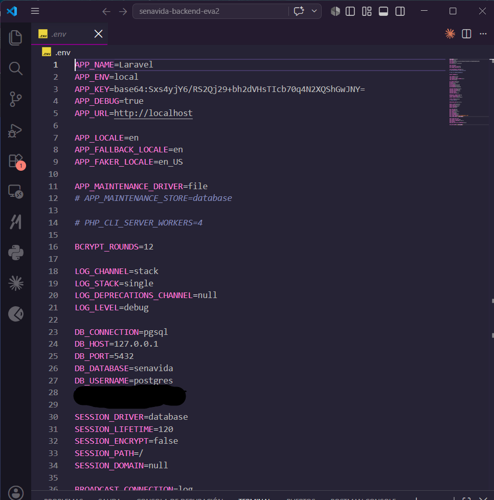

La captura muestra el bloque de conexión a base de datos: `DB_CONNECTION=pgsql`, `DB_HOST=127.0.0.1`, `DB_PORT=5432`, `DB_DATABASE=senavida`, `DB_USERNAME=postgres`. Esto confirma que el proyecto está configurado para conectarse a **PostgreSQL**, tal como exige el enunciado.

> 🔒 **Buena práctica aplicada:** el valor real de `DB_PASSWORD` fue cubierto intencionalmente en la captura antes de subir este informe al repositorio público de GitHub — evitando exponer una credencial real, tal como haría cualquier desarrollador profesional.

### 2.2 Verificación de la conexión (`php artisan about`)

> **Qué demuestra:** que Laravel está conectado a PostgreSQL de verdad (no solo declarado en el `.env`, sino en ejecución).

`php artisan about` es un comando que muestra una "ficha técnica" completa del proyecto en el momento exacto en que se ejecuta: versión de Laravel, de PHP, y — lo más importante aquí — a qué motor de base de datos está conectado *ahora mismo*.

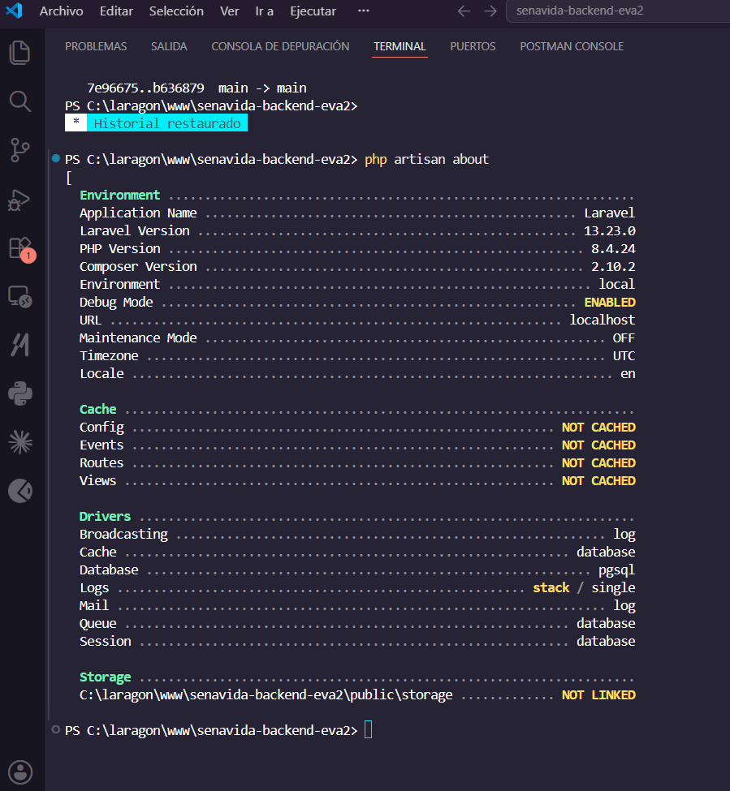

La salida del comando confirma la configuración real del proyecto en ejecución: `Laravel Version 13.23.0`, `PHP Version 8.4.24`, y en la sección **Drivers → Database: `pgsql`**. Esto prueba que la aplicación está efectivamente conectada a PostgreSQL, no solo declarado en el `.env`.

### 2.3 Migraciones ejecutadas (`php artisan migrate:status`)

> **Qué demuestra:** que todas las tablas del sistema se crearon correctamente.

Las **migraciones** son como planos de construcción para la base de datos: cada archivo de migración describe una tabla (sus columnas, tipos de dato, relaciones). `migrate:status` muestra cuáles de esos planos ya se "construyeron" de verdad en PostgreSQL.


Todas las migraciones del proyecto figuran en estado **`Ran`**, incluyendo `create_users_table`, `create_personal_access_tokens_table` (Sanctum), `create_audit_logs_table`, `create_organizations_table`, `create_health_centers_table`, `create_units_table` y `add_foreign_keys_to_users_table`. Esto confirma que todas las tablas del sistema fueron creadas correctamente en PostgreSQL.

---

## 3. Evidencias de Autenticación

> 💡 **¿Qué se está probando aquí?** La autenticación es el "portero" del sistema: decide quién entra y quién no. Un buen sistema de login no solo debe **aceptar** las credenciales correctas — también debe **rechazar** las incorrectas, **protegerse** contra quien intente adivinar contraseñas a la fuerza, y **saber revocar el acceso** cuando alguien cierra sesión. Esta sección prueba las cinco caras de esa moneda.

El siguiente diagrama resume el flujo completo, de principio a fin, antes de entrar al detalle de cada endpoint:


### 3.1 Login exitoso

> **Endpoint:** `POST /api/v1/auth/login`
> **Qué demuestra:** que un usuario con credenciales correctas recibe un token Sanctum válido.

**Petición enviada:**
```json
{
  "email": "medico.maternidad@test.com",
  "password": "password123"
}
```


**Resultado obtenido:** `200 OK` en `635 ms`. La respuesta incluye `"success": true` y dentro de `"data"`: el `token` de Sanctum (cuyo valor se omite aquí por seguridad), el `tokenType: "Bearer"`, y los datos del usuario autenticado (`id`, `name: "Dr. Maternidad"`, `email`, `role: "medico"`, `isActive: true`).

Esto confirma que el login **valida las credenciales de verdad** y entrega un token Bearer real de Sanctum, listo para usarse en los siguientes endpoints protegidos.

---

### 3.2 Login fallido (credenciales inválidas)

> **Endpoint:** `POST /api/v1/auth/login`
> **Qué demuestra:** que el sistema rechaza credenciales incorrectas y no entrega token. Esto prueba que el login **valida de verdad** (no acepta cualquier cosa).


**Resultado obtenido:** `422 Unprocessable Content` en `1.62 s`. La respuesta indica `"message": "Las credenciales no son correctas."`, con el detalle del error en `"errors" → "email"`.

Esto confirma que el endpoint **rechaza credenciales incorrectas** y no entrega ningún token, cerrando la puerta a accesos no autorizados.

---

### 3.3 Protección contra fuerza bruta (rate limiting)

> **Endpoint:** `POST /api/v1/auth/login`
> **Qué demuestra:** que tras varios intentos fallidos seguidos, el sistema bloquea temporalmente los intentos (protección de seguridad profesional).

**Respuesta esperada:** al 6.º intento fallido, `429 Too Many Requests` con el mensaje de segundos de espera.


**Resultado obtenido:** tras 5 intentos fallidos consecutivos con credenciales incorrectas, el 6.º intento devolvió `429 Too Many Requests` en `265 ms`, con el mensaje `"Demasiados intentos. Intenta de nuevo en 16 segundos."`.

Esto confirma que el `RateLimiter` de Laravel está protegiendo activamente el endpoint de login contra ataques de fuerza bruta, bloqueando temporalmente el email/IP tras superar el máximo de intentos permitidos.

---

### 3.4 Endpoint `/me` (usuario autenticado)

> **Endpoint:** `GET /api/v1/auth/me`
> **Qué demuestra:** que un token válido permite identificar al usuario dueño de la sesión. Prueba que el **middleware de autenticación** (`auth:sanctum`) funciona.

**Configuración:** en Postman, pestaña **Authorization → Bearer Token**, pegar el token obtenido en el login (copiado directamente desde la respuesta, nunca transcrito a mano).


**Resultado obtenido:** `200 OK` en `371 ms`. La respuesta devuelve `"success": true` y dentro de `"data" → "user"` los datos del usuario autenticado: `id`, `name: "Super Admin"`, `email: "superadmin@test.com"`, `role: "super_admin"`, `isActive: true`.

Esto confirma que el middleware `auth:sanctum` valida correctamente el token Bearer y resuelve la identidad del usuario dueño de la sesión.

---

### 3.5 Logout (revocación del token)

> **Endpoint:** `POST /api/v1/auth/logout`
> **Qué demuestra:** que el cierre de sesión **revoca el token**, de modo que ya no sirve para nada después.

**Respuesta esperada:** `200 OK` confirmando el cierre de sesión.


**Resultado obtenido:** `200 OK` en `356 ms`, con `"success": true`. Esto confirma que la petición de logout se procesó correctamente sobre el token activo del `super_admin`.

**Prueba complementaria (opcional pero potente):** volver a llamar a un endpoint protegido con el **mismo token** después del logout → debe devolver `401 Unauthorized`.

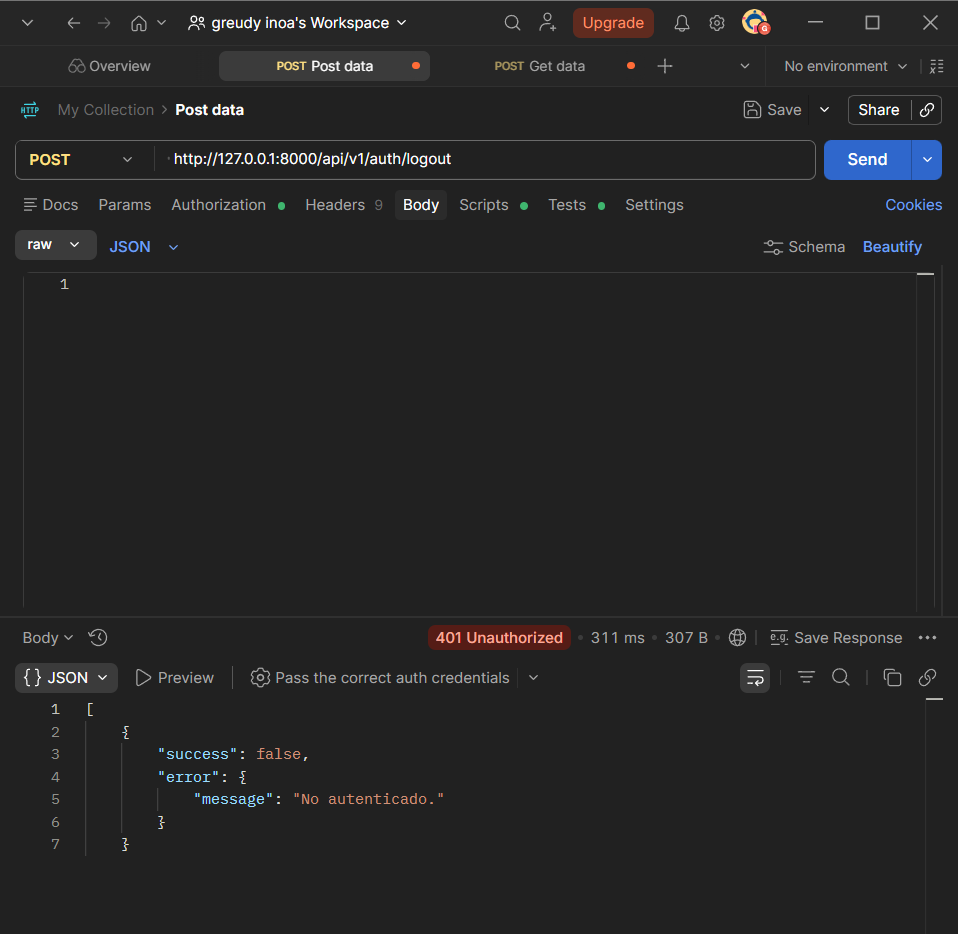

**Resultado obtenido:** al reutilizar el mismo token (`11|...`) después de haber cerrado sesión con él, la API devuelve `401 Unauthorized` con `"message": "No autenticado."`.

Esto demuestra que el logout **revoca el token de verdad** en la base de datos — no es solo una respuesta de cortesía en el frontend; el token queda inservible para cualquier petición posterior.

---

## 4. Evidencias de Registro de Usuarios y Cifrado

> 💡 **¿Por qué esta sección es tan importante?** Guardar una contraseña **tal como el usuario la escribió** (en "texto plano") es uno de los errores de seguridad más graves que puede cometer un sistema — si alguien accede a la base de datos, tendría todas las contraseñas reales. Por eso, ningún backend serio guarda contraseñas así: las **cifra** con un algoritmo que las convierte en un texto irreversible (un *hash*). Esta sección demuestra, con evidencia directa en la base de datos, que SeñaVida hace esto correctamente. Es, además, el **Indicador 3** completo de la rúbrica.

### 4.1 Registro de usuario exitoso

> **Endpoint:** `POST /api/v1/users`
> **Qué demuestra:** que un administrador autenticado puede crear un usuario nuevo, con todas las validaciones.

**Petición enviada:**
```json
{
  "name": "Enfermera de Prueba",
  "email": "enfermera.prueba@test.com",
  "password": "password123",
  "password_confirmation": "password123",
  "role": "categorizacion",
  "organizationId": "01a003c6-e068-71b0-8165-7657c0a84b44",
  "healthCenterId": "01a003c8-20e8-7095-b24b-08918e04f79a",
  "unitId": "01a003c9-6a18-73c6-bc23-70b80f0395fa"
}
```


**Resultado obtenido:** `201 Created` en `1.38 s`. La respuesta devuelve `"success": true` y los datos del usuario creado (`id`, `name: "Enfermera de Prueba"`, `email`, `role: "categorizacion"`, `isActive: true`) — **sin incluir la contraseña en ningún formato**, ni siquiera cifrada.

Esto confirma que el endpoint crea correctamente un usuario nuevo, asociado al Hospital San Rafael → Urgencia Adulto, y que la respuesta respeta la buena práctica de nunca exponer la contraseña.

---

### 4.2 Prueba del cifrado en la base de datos (Tinker) ⭐

> **Qué demuestra:** que la contraseña **NO se guarda en texto plano**, sino cifrada con bcrypt. **Esta es la evidencia clave del cifrado.**

**Comando ejecutado en Tinker:**
```php
User::where('email', 'enfermera.prueba@test.com')->first()->password;
```


**Resultado obtenido:**
```
$2y$12$fU2Ak7sfTq/Luog9hBjr.etaHlRrAkg9ctKgLCn2Wdo9DoSiAh3zy
```

> **Explicación:** aunque en Postman se envió la contraseña `password123` en texto plano, en la base de datos quedó guardada como un hash irreversible en formato **bcrypt** (`$2y$12$...`, donde `12` es el número de rondas de cifrado configurado en `BCRYPT_ROUNDS`). Esto se logra con el cast `'password' => 'hashed'` en el modelo `User`, que cifra automáticamente la contraseña al guardarla — sin necesidad de llamar a `Hash::make()` manualmente en el controlador.

---

### 4.3 Validación de datos duplicados

> **Endpoint:** `POST /api/v1/users`
> **Qué demuestra:** que el sistema rechaza crear un usuario con un email que ya existe (regla `unique`).

**Respuesta esperada:** `422 Unprocessable Content` con el mensaje de que el email ya está en uso.


**Resultado obtenido:** `422 Unprocessable Content` en `424 ms`, con el mensaje `"The email has already been taken."`. La misma petición del punto 4.1, repetida sin cambios, fue rechazada por la regla de validación `unique` sobre el campo `email`.

Esto confirma que el sistema **evita duplicados a nivel de servidor**, no solo a nivel de interfaz — cualquier intento de crear dos cuentas con el mismo correo es bloqueado.

---

## 5. Evidencias de Catálogos

> 💡 **¿Qué son los "catálogos" en este proyecto?** SeñaVida no atiende a un solo hospital: está pensado para que **varias organizaciones de salud** (por ejemplo, distintos servicios de salud regionales) usen el mismo sistema, cada una con sus propios hospitales (**centros de salud**) y, dentro de cada hospital, sus propias salas (**unidades**, como "Urgencia Adulto" o "Maternidad"). Estas tres entidades forman una jerarquía: `Organización → Centro de Salud → Unidad`. Esta sección prueba que esa jerarquía se puede crear y consultar correctamente por la API — y de paso, revela dos capas de seguridad extra que no eran obligatorias, pero que hacen al sistema más robusto: control de roles y aislamiento de datos entre hospitales.

El siguiente diagrama resume visualmente esa jerarquía, con datos reales del proyecto (los mismos que se crean y consultan en esta sección):


### 5.1 Crear Organización

> **Endpoint:** `POST /api/v1/organizations`
> **Qué demuestra:** que un `super_admin` puede dar de alta una nueva organización de salud desde cero.

**Petición enviada:**
```json
{
  "name": "Servicio de Salud Metropolitano"
}
```


**Resultado obtenido:** `201 Created` en `908 ms`, devolviendo el `id` (UUID) generado y el `name` de la organización creada.

---

### 5.2 Crear Centro de Salud

> **Endpoint:** `POST /api/v1/health-centers`
> **Qué demuestra:** que un centro de salud se crea vinculado a su organización mediante `organizationId`.

**Petición 1 — "Hospital San Rafael":**
```json
{
  "name": "Hospital San Rafael",
  "organizationId": "01a003c6-e068-71b0-8165-7657c0a84b44"
}
```


**Resultado obtenido:** `201 Created` en `863 ms`.

**Petición 2 — "Hospital Santa Lucía" (segundo centro, misma organización):**
```json
{
  "name": "Hospital Santa Lucía",
  "organizationId": "01a003c6-e068-71b0-8165-7657c0a84b44"
}
```


**Resultado obtenido:** `201 Created` en `723 ms`. Ambos centros quedan asociados a la misma `organizationId`, confirmando que una organización puede tener múltiples centros de salud (relación `hasMany`).

---

### 5.3 Crear Unidad

> **Endpoint:** `POST /api/v1/units`
> **Qué demuestra:** que una unidad se crea vinculada a su centro de salud mediante `healthCenterId`.

**Petición 1 — "Urgencia Adulto":**
```json
{
  "name": "Urgencia Adulto",
  "healthCenterId": "01a003c8-20e8-7095-b24b-08918e04f79a"
}
```


**Resultado obtenido:** `201 Created` en `679 ms`.

**Petición 2 — "Urgencia Infantil" (segunda unidad, mismo centro):**
```json
{
  "name": "Urgencia Infantil",
  "healthCenterId": "01a003c8-20e8-7095-b24b-08918e04f79a"
}
```


**Resultado obtenido:** `201 Created` en `752 ms`. Ambas unidades quedan asociadas al mismo `healthCenterId`, confirmando que un centro de salud puede tener múltiples unidades (relación `hasMany`).

> **Nota:** de la misma forma se crearon el resto de las unidades del sistema: "Maternidad" para el Hospital San Rafael, y "Urgencia Adulto", "Traumatología", "Pediatría" para el Hospital Santa Lucía, completando el catálogo que se muestra en el listado de la sección 5.7.
>
> 

---

### 5.4 Evidencia adicional — Control de roles (RBAC) en el registro de usuarios

> Esta evidencia complementa la sección 4: confirma que **solo los roles autorizados** (`admin_institucional`, `super_admin`) pueden crear usuarios nuevos — cualquier otro rol autenticado es rechazado, incluso si su token es válido.

El siguiente diagrama resume la regla que se prueba a continuación: quién puede crear qué dentro del sistema.


**Caso permitido — usuario con rol autorizado:**


**Resultado obtenido:** `201 Created` en `1.26 s`. El usuario "Enfermero Uno SR" se registró correctamente porque quien hizo la petición tenía un rol con permiso para crear usuarios.

**Caso bloqueado — usuario con rol sin autorización:**


**Resultado obtenido:** `403 Forbidden` en `766 ms`, con el mensaje `"No tienes permiso para registrar usuarios."`, usando la misma petición pero un token de un rol sin autorización para esta acción.

Esto confirma que el control de acceso por rol (RBAC) está aplicado **a nivel de servidor**, no solo ocultando botones en el frontend — un token válido no es suficiente por sí solo; el rol del usuario también se verifica en cada operación sensible.

---

### 5.5 Listado de Organizaciones

> **Endpoint:** `GET /api/v1/organizations`
> **Qué demuestra:** que las organizaciones creadas en el punto 5.1 se persisten correctamente en PostgreSQL y se pueden consultar vía API.


**Resultado obtenido:** `200 OK` en `736 ms`, con `"success": true` y un arreglo `"data"` que incluye las organizaciones registradas.

---

### 5.6 Listado de Centros de Salud

> **Endpoint:** `GET /api/v1/health-centers`
> **Qué demuestra:** que los centros de salud creados en el punto 5.2 están correctamente vinculados a su organización.


**Resultado obtenido:** `200 OK` en `691 ms`. Cada centro ("Hospital San Rafael", "Hospital Clínico Sur") muestra su `organizationId` correspondiente, confirmando la relación `belongsTo` entre `HealthCenter` y `Organization`.

---

### 5.7 Listado de Unidades

> **Endpoint:** `GET /api/v1/units` — con y sin filtro por centro de salud
> **Qué demuestra:** que las unidades creadas en el punto 5.3 están correctamente vinculadas a su centro de salud, y que el endpoint soporta filtrado por `healthCenterId`.

**Sin filtro (todas las unidades):**


**Resultado obtenido:** `200 OK` en `732 ms`, con todas las unidades del sistema y su `healthCenterId` respectivo.

**Con filtro por centro de salud (`?healthCenterId=...`):**


**Resultado obtenido:** `200 OK` en `726 ms`, devolviendo únicamente las unidades del centro solicitado ("Urgencia Adulto", "Urgencia Infantil", "Maternidad"), confirmando que el filtro por query param funciona correctamente.

---

### 5.8 Evidencia adicional — Aislamiento por multitenancy

> Esta evidencia no estaba en el plan original, pero refuerza un aspecto de seguridad importante del sistema: que un `admin_institucional` **solo puede gestionar usuarios de su propio centro de salud**, nunca de otro.

**Caso permitido — registrar en el propio centro:**


**Resultado obtenido:** `201 Created`. El usuario `admin_institucional` registró exitosamente a "Prueba Mismo Centro" porque el `healthCenterId` enviado coincide con el centro al que pertenece.

**Caso bloqueado — intento de registrar en otro centro:**

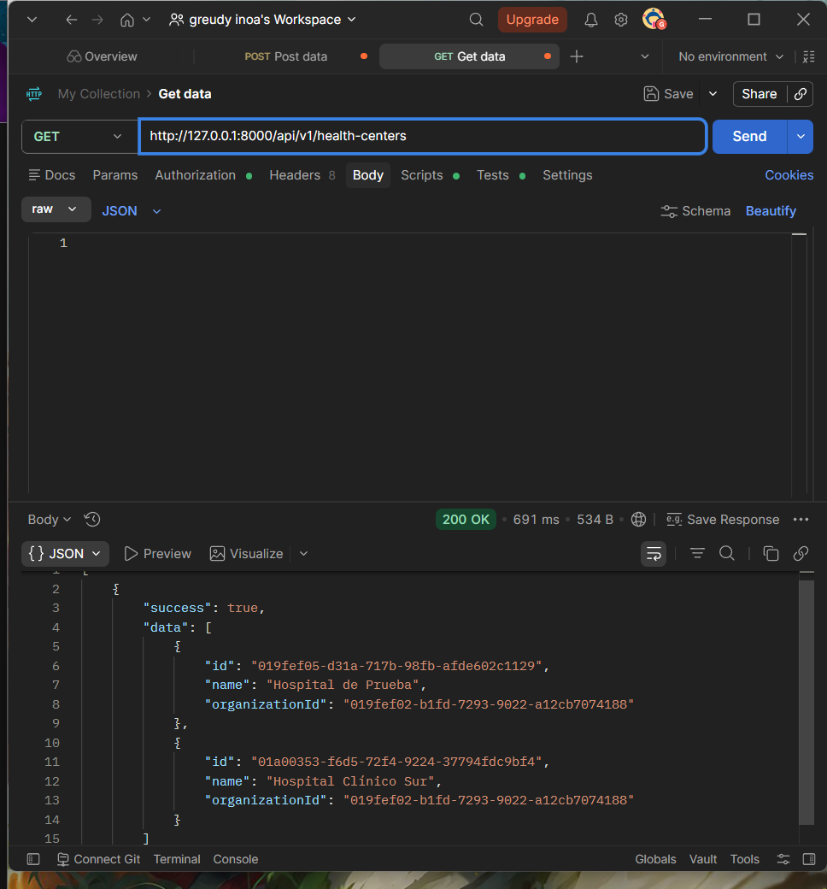

**Resultado obtenido:** `403 Forbidden` en `1.05 s`, con el mensaje `"Solo puedes registrar usuarios en tu propio centro de salud."`. El mismo `admin_institucional` intentó registrar un usuario en un centro de salud distinto al suyo, y el sistema lo rechazó.

Esto confirma que la restricción de **multitenancy** no es solo una regla de negocio documentada, sino que está **implementada y forzada activamente en el servidor**, evitando que un administrador institucional gestione datos fuera de su propio centro.

---

## 6. Documentación interactiva con Swagger

> 💡 **¿Qué problema resuelve esta sección?** Hasta aquí, cada endpoint se probó con Postman — una herramienta que vive en el computador de quien desarrolla. Pero el backend de SeñaVida no lo consume solo su autora: lo consume **el frontend**, construido en paralelo por otra persona. Sin una documentación viva, cada endpoint nuevo obligaría a escribir un mensaje explicando qué recibe, qué devuelve y con qué errores puede fallar.
>
> **Swagger (OpenAPI)** resuelve exactamente eso: genera una página web, a partir del propio código del backend, donde **cada endpoint se puede leer y ejecutar desde el navegador**. Es documentación que no se desactualiza, porque nace del código y no de un documento aparte.

### 6.1 La interfaz generada

> **URL:** `http://127.0.0.1:8000/api/documentation`
> **Qué demuestra:** que la documentación OpenAPI 3.0 se genera correctamente y describe la API real del proyecto.


**Resultado obtenido:** la interfaz carga con el título **SenaVida API**, versión `1.0.0`, especificación **OAS 3.0**, y el servidor base correctamente apuntado a `http://127.0.0.1:8000/api/v1`. Debajo aparece el buscador por etiquetas y el primer grupo de endpoints.

> **Detalle técnico:** esta página no se escribió a mano. Se genera con el paquete `darkaonline/l5-swagger` a partir de **atributos nativos de PHP 8** (`#[OA\Get(...)]`, `#[OA\Post(...)]`) escritos directamente sobre cada método de cada controlador. Al ejecutar `php artisan l5-swagger:generate`, el paquete recorre el código y produce el archivo `api-docs.json` que alimenta esta interfaz.

### 6.2 Autenticación desde la propia documentación

> **Qué demuestra:** que Swagger reconoce el esquema de seguridad Bearer y permite autenticarse para probar endpoints protegidos.

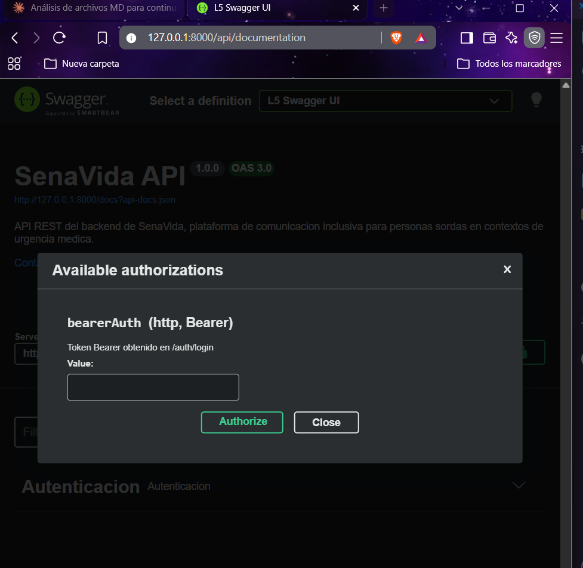

**Resultado obtenido:** el botón **Authorize** abre el cuadro `Available authorizations`, con el esquema `bearerAuth (http, Bearer)` y la descripción *"Token Bearer obtenido en /auth/login"*.

Al pegar aquí un token válido, **todas las peticiones posteriores lo incluyen automáticamente** en el header `Authorization`. Esto convierte a Swagger en un banco de pruebas completo: se puede recorrer la API entera sin salir del navegador ni configurar nada externo.

### 6.3 Los cuatro grupos de endpoints

Los endpoints están organizados por etiquetas (`tags`), que agrupan las operaciones por área funcional:

**Autenticación:**

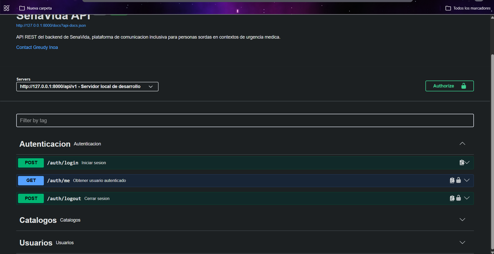

Tres operaciones: `POST /auth/login` (iniciar sesión), `GET /auth/me` (obtener usuario autenticado) y `POST /auth/logout` (cerrar sesión). Nótese el **candado** junto a los dos últimos: Swagger marca visualmente cuáles exigen token.

**Catálogos:**

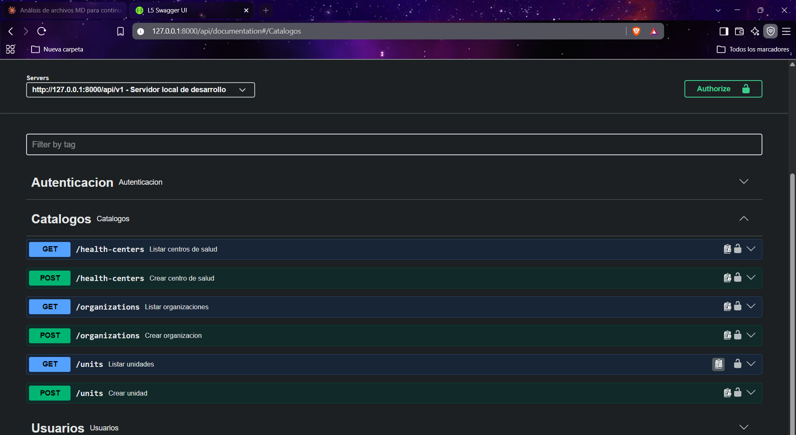

Las operaciones de lectura y creación sobre las tres entidades de la jerarquía institucional: `/health-centers`, `/organizations` y `/units`.

**Usuarios:**

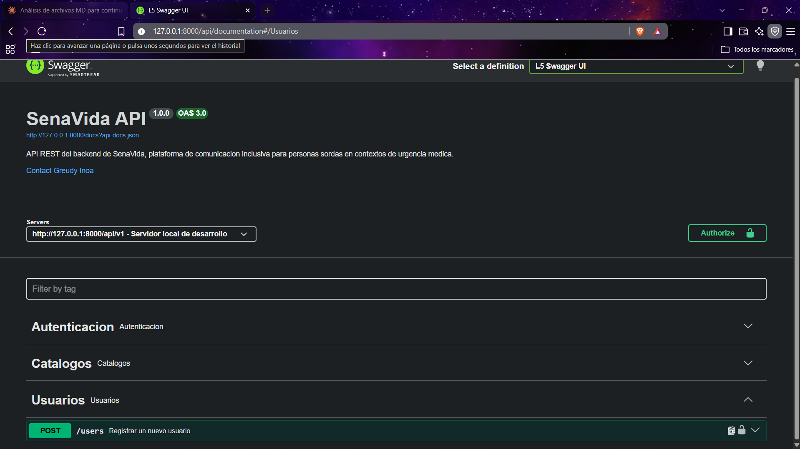

El registro de usuarios del personal de salud, `POST /users`, también protegido con token.

### 6.4 Ejecución real desde Swagger — Autenticación

Lo importante de Swagger no es que *describa* los endpoints, sino que permita **ejecutarlos de verdad**. Las siguientes capturas muestran el ciclo completo de autenticación corrido íntegramente desde el navegador.

**Login:**


**Resultado obtenido:** `200 OK`. La respuesta entrega el `token` de Sanctum, el `tokenType: "Bearer"` y los datos del usuario `Super Admin` con rol `super_admin`.

> 🔒 **Buena práctica aplicada:** el valor del token fue **cubierto intencionalmente** en todas las capturas de este informe antes de subirlas al repositorio público. Un token Bearer es una credencial activa: publicarlo equivale a publicar una contraseña. Este mismo criterio se aplicó antes al valor de `DB_PASSWORD` en la sección 2.1.

**Usuario autenticado (`/auth/me`):**


**Resultado obtenido:** `200 OK` devolviendo la identidad del usuario dueño del token — confirmando que el token pegado en `Authorize` viaja correctamente en cada petición.

**Logout:**


**Resultado obtenido:** `200 OK` con `{"success": true}`. El token queda revocado en el servidor de inmediato.

### 6.5 Ejecución real desde Swagger — Creación de catálogos

Para verificar que Swagger no solo sirve para leer sino también para **escribir**, se recreó la jerarquía institucional completa desde la propia documentación:

**Organización:**


`201 Created` — se creó `"Servicio de Salud Prueba Swagger"`.

**Centro de salud:**

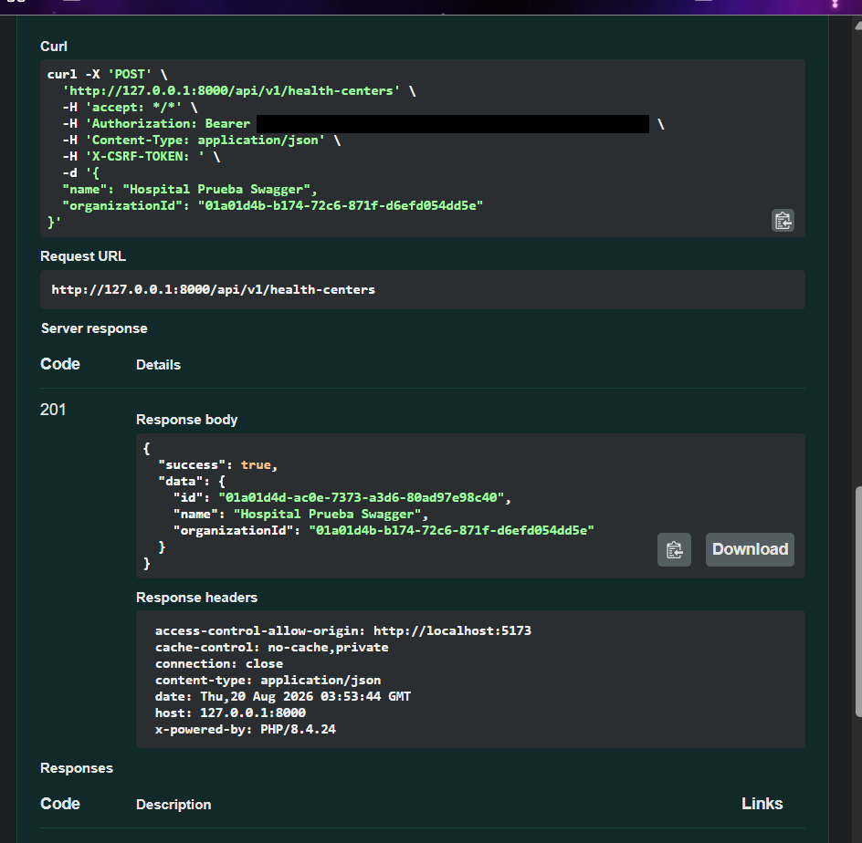

`201 Created` — se creó `"Hospital Prueba Swagger"`, vinculado por `organizationId` a la organización anterior.

**Unidad:**


`201 Created` — se creó `"Unidad Prueba Swagger"`, vinculada por `healthCenterId` al centro anterior.

**Usuario:**


`201 Created` — se creó `"Usuario Prueba Swagger"` con rol `admision`, asociado a la organización, centro y unidad recién creados. La contraseña **no aparece en la respuesta**, ni en texto plano ni cifrada.

> **Lo que demuestra esta secuencia:** los cuatro niveles del sistema (`Organización → Centro → Unidad → Usuario`) se pueden construir de punta a punta desde la documentación, respetando las relaciones entre ellos. Cada `id` devuelto alimenta la petición siguiente.

### 6.6 Ejecución real desde Swagger — Listados

**Organizaciones:**

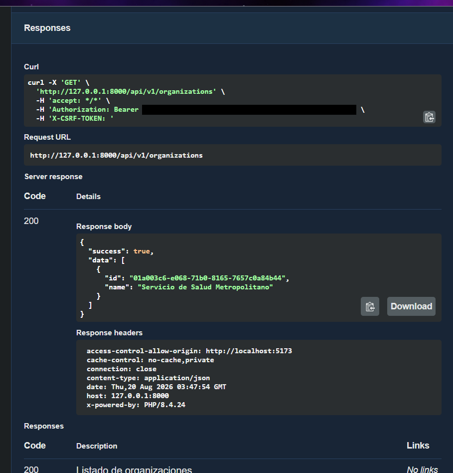

**Centros de salud:**


`200 OK` con `"Hospital San Rafael"` y `"Hospital Santa Lucía"`, cada uno con su `organizationId`.

**Unidades — sin filtro:**

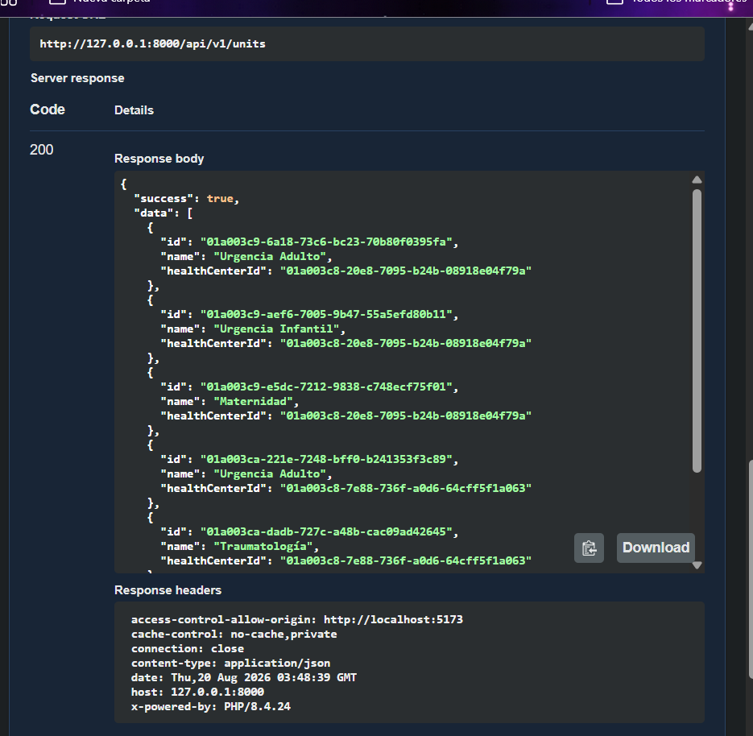

`200 OK` con las unidades de todos los centros: `Urgencia Adulto`, `Urgencia Infantil`, `Maternidad`, `Traumatología`.

**Unidades — filtradas por centro (`?healthCenterId=`):**


`200 OK` devolviendo **únicamente** las tres unidades del Hospital San Rafael. El filtro por *query parameter* funciona correctamente, y Swagger lo documenta como parámetro opcional.

---

## 7. CRUD administrativo completo

> 💡 **¿Qué falta cuando solo se puede crear y listar?** Las secciones anteriores demostraron que se pueden **crear** y **consultar** organizaciones, centros, unidades y usuarios. Pero un sistema real necesita también **corregir** datos mal cargados y **retirar de circulación** entidades que ya no operan. Esta sección documenta esas dos operaciones faltantes.
>
> Hay una decisión de diseño importante detrás: **SeñaVida nunca borra registros de verdad**. Al "eliminar" una entidad, lo que hace es marcarla como inactiva (`isActive: false`) — un patrón llamado **borrado lógico** (*soft delete*). En un sistema de salud esto no es opcional: un hospital dado de baja sigue teniendo atenciones históricas asociadas, y borrarlo físicamente destruiría trazabilidad clínica.

### 7.1 CRUD de Usuarios

**Listar todos los usuarios:**


`200 OK` con el listado completo, mostrando para cada usuario su `role` y su ubicación en la jerarquía (`organizationId`, `healthCenterId`, `unitId`). Nótese que el `super_admin` tiene los tres campos en `null`: no pertenece a ningún centro concreto porque su alcance es global.

**Ver un usuario específico:**


`200 OK` con la ficha completa del usuario `"Usuario Prueba Swagger"`, rol `admision`.

**Editar un usuario:**


`200 OK` — el `PUT` actualizó el nombre a `"Usuario Editado desde Swagger"`. La respuesta devuelve el registro ya modificado.

**Desactivar un usuario:**


`200 OK` con `{"id": ..., "isActive": false}`. El `DELETE` **no eliminó la fila**: cambió su estado.

**Verificar la desactivación:**


`200 OK` — el registro **sigue existiendo y sigue siendo consultable**, ahora con `isActive: false`. Esta captura es la prueba directa de que el borrado es lógico y no físico: si hubiera sido un `DELETE` real, esta consulta habría devuelto `404`.

### 7.2 CRUD de Organizaciones

El mismo ciclo aplicado al nivel más alto de la jerarquía:

**Listar:**


`200 OK` con las dos organizaciones del sistema, ambas con `isActive: true`.

**Ver una organización:**


**Editar:**

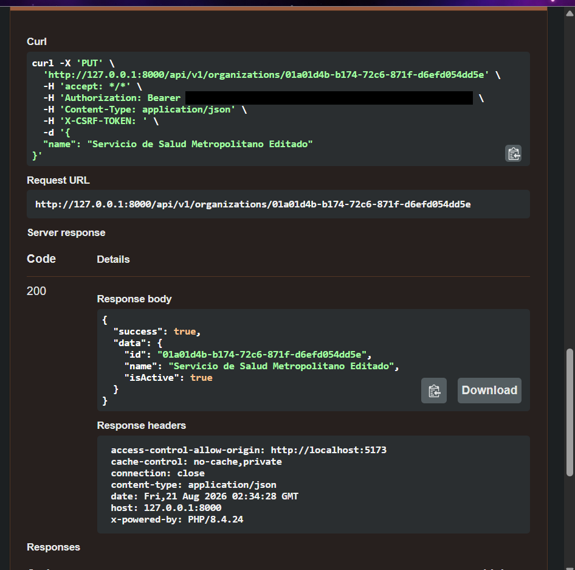

`200 OK` — el nombre pasó a `"Servicio de Salud Metropolitano Editado"`.

**Desactivar:**

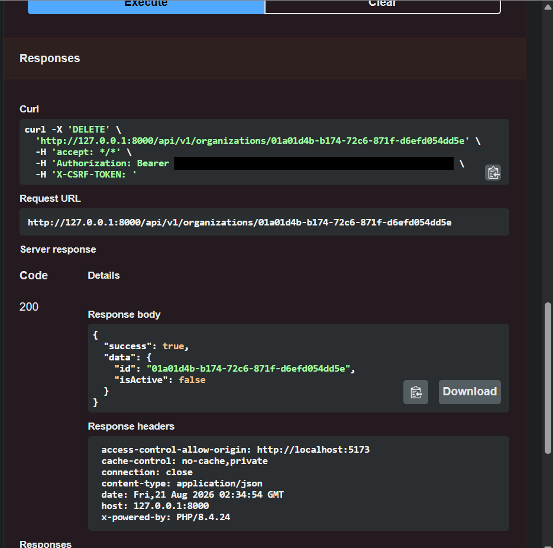

`200 OK` con `isActive: false`.

**Verificar:**

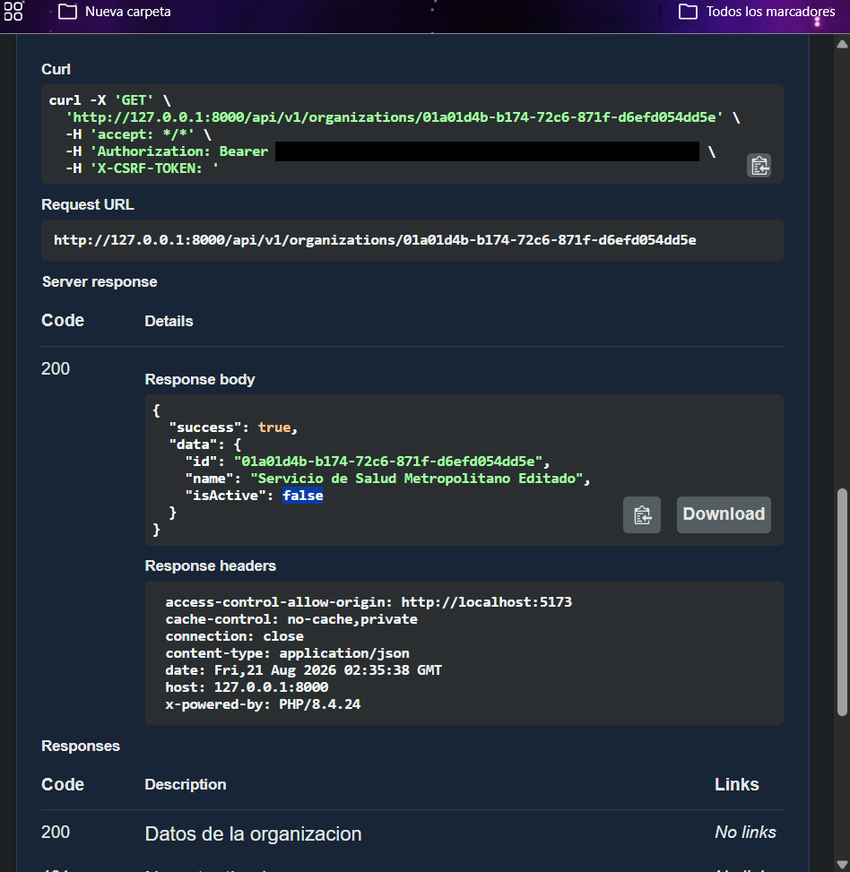

`200 OK` — el registro persiste con su nombre editado y su estado inactivo.

### 7.3 CRUD de Centros de Salud

**Listar:**

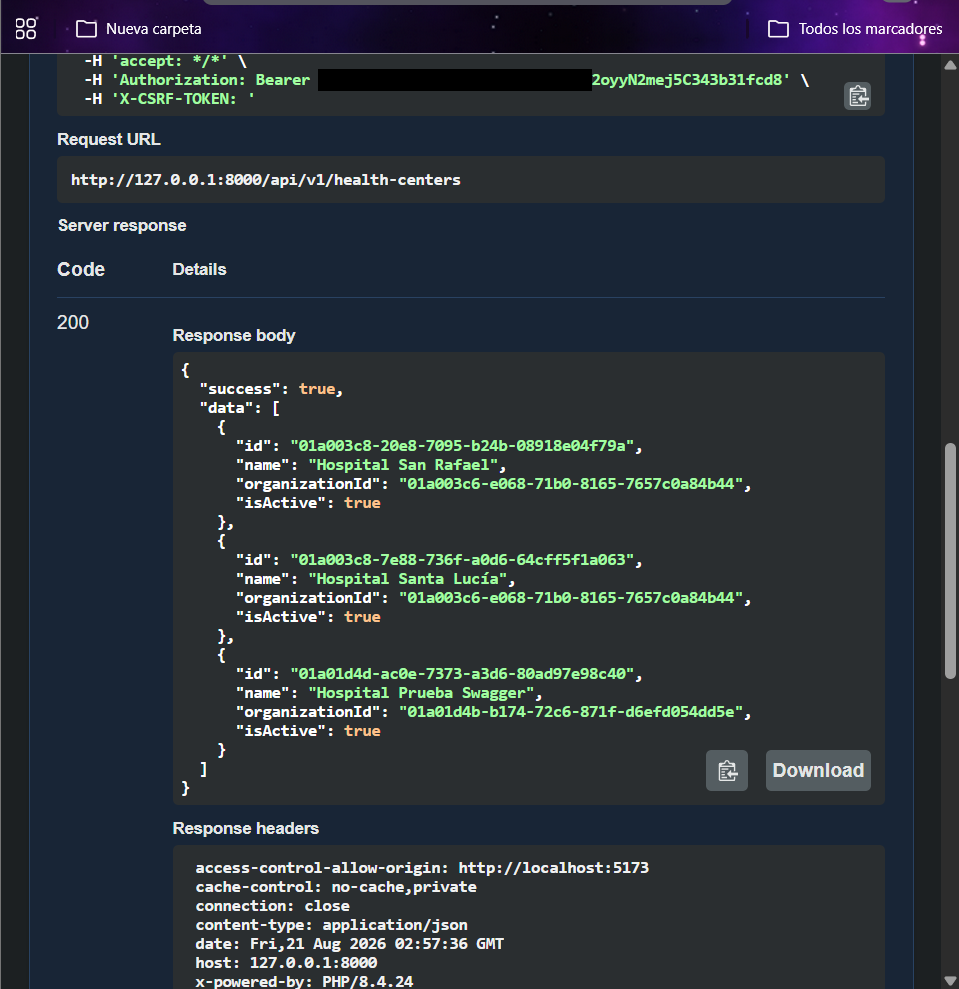

`200 OK` con los tres centros del sistema y su estado.

**Ver un centro:**


`200 OK` con los datos del `"Hospital San Rafael"`. Debajo de la respuesta, Swagger muestra la **tabla de códigos documentados** para este endpoint: `200` (datos del centro), `401` (no autenticado), `403` (sin permiso) y `404` (centro no encontrado).

> **Por qué importa esa tabla:** documentar los errores posibles es tan valioso como documentar el caso exitoso. El frontend necesita saber de antemano qué puede recibir para manejar cada caso sin adivinar.

**Editar:**

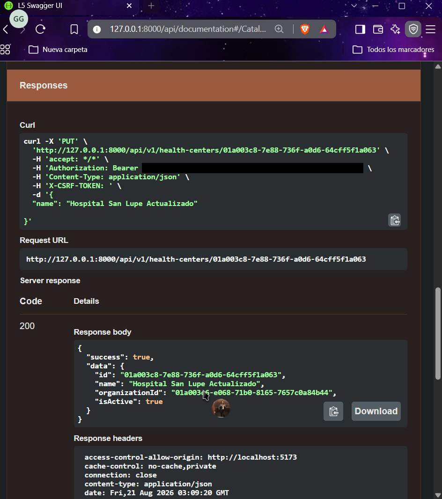

`200 OK` — el nombre pasó a `"Hospital San Lupe Actualizado"`.

**Desactivar:**


`200 OK` con `isActive: false`.

**Verificar:**


`200 OK` — el centro sigue consultable, con su nombre editado y desactivado.

### 7.4 Manejo de rutas inexistentes

> **Qué demuestra:** cómo responde el framework cuando la ruta solicitada no está registrada.


**Resultado obtenido:** `404 Not Found` con el mensaje `"The route api/v1/health-centers/{id} could not be found."` y la excepción `Symfony\Component\HttpKernel\Exception\NotFoundHttpException`.

Esta captura se tomó **durante la construcción** del endpoint de detalle, antes de registrar la ruta — y conviene distinguir dos tipos de `404` que se ven parecidos pero significan cosas distintas:

| Tipo | Significado | Cuándo ocurre |
|---|---|---|
| **Ruta no encontrada** | La URL no corresponde a ningún endpoint registrado | El endpoint no existe o está mal escrito |
| **Recurso no encontrado** | El endpoint existe, pero el `id` solicitado no está en la base de datos | Se pide una entidad que no existe (o de otro centro, por aislamiento) |

El primero es lo que muestra esta captura; el segundo es el `404` documentado en la tabla de la sección 7.3. La captura 54 confirma que, una vez registrada la ruta, el mismo `id` devuelve `200` correctamente.

> ⚠️ **Nota de seguridad:** la respuesta incluye la traza completa del error con rutas absolutas del servidor (`C:\laragon\www\...`). Esto ocurre porque el entorno local tiene `APP_DEBUG=true`. **En producción, `APP_DEBUG` debe estar en `false`**, y Laravel entrega entonces un mensaje genérico sin exponer estructura interna ni rutas del sistema de archivos — información que un atacante podría aprovechar.

---

## 8. Hito 1 — Modelo de Paciente

> 💡 **El cambio de perspectiva de esta sección.** Todo lo anterior gira en torno al **personal de salud**: usuarios que inician sesión, con roles y permisos. Aquí entra el otro protagonista del sistema, y funciona con reglas completamente distintas.
>
> El paciente de SeñaVida es una **persona sorda que llega a urgencias**. No tiene cuenta, no tiene contraseña, y probablemente está en una situación de estrés donde crear credenciales sería un obstáculo inaceptable. Por eso el registro del paciente es un **endpoint público**: cualquiera puede completarlo desde su propio teléfono, sin token, sin login.

### 8.1 Autorregistro del paciente

> **Endpoint:** `POST /api/v1/patients` — 🔓 **público, sin autenticación**
> **Qué demuestra:** que un paciente puede registrarse por sí mismo, sin intervención de personal ni credenciales.


**Resultado obtenido:** `201 Created`. Obsérvese en el comando `curl` que **no existe header `Authorization`** — la petición no lleva token de ningún tipo, y aun así el servidor la acepta.

Los datos enviados incluyen identificación (`national_id`, `national_id_type`), fecha de nacimiento, previsión de salud, dirección, teléfono, CESFAM de origen, alergias, condiciones de salud y — el campo más importante para la misión del proyecto — la **preferencia de comunicación** (`texto`, `senas`, `mixto`).

**Detalle destacable de la respuesta:**

```json
{
  "id": "01a024de-7763-71df-8bb4-42495f3c999c",
  "name": "Juan Soto",
  "nationalId": "98765432-1",
  "age": 36,
  "communicationPreference": "texto",
  "isActive": true
}
```

El campo `age` **no se envió en la petición**. Se calcula en el servidor a partir de `birth_date` mediante un *accessor* del modelo que usa Carbon. Esto evita un problema clásico: si la edad se guardara como un número fijo, quedaría desactualizada al día siguiente del cumpleaños del paciente. Guardando la fecha de nacimiento y derivando la edad al momento de consultarla, el dato **siempre es correcto**.

### 8.2 Control de duplicados

> **Qué demuestra:** que el sistema impide registrar dos veces a la misma persona.

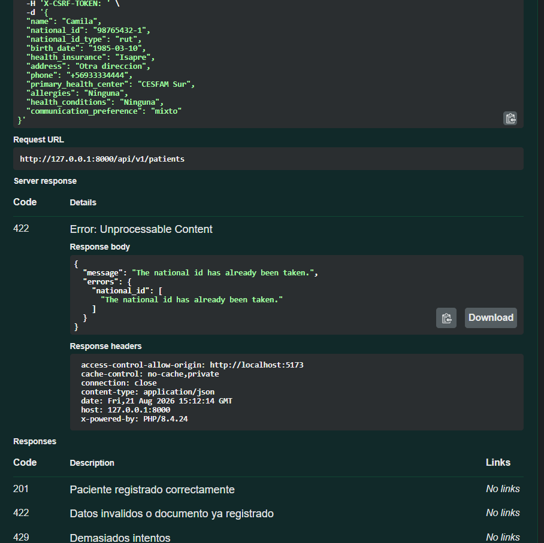

**Resultado obtenido:** `422 Unprocessable Content` con el mensaje `"The national id has already been taken."`.

La petición usó **el mismo `national_id`** (`98765432-1`) que el registro anterior, pero con un nombre distinto (`"Camila"`) y todos los demás datos cambiados. El servidor lo rechazó igualmente, porque la regla `unique` se aplica sobre el documento de identidad, no sobre el nombre.

> **Por qué esto es crítico en un contexto clínico:** si el sistema permitiera dos fichas para la misma persona, un profesional podría abrir la ficha equivocada y no ver alergias o condiciones registradas en la otra. En urgencias, ese error puede tener consecuencias graves.

### 8.3 Consulta de pacientes por el personal autorizado

> **Endpoint:** `GET /api/v1/patients` — 🔒 requiere token
> **Qué demuestra:** que el personal de salud autenticado puede consultar el listado de pacientes.


**Resultado obtenido:** `200 OK` con los pacientes registrados, cada uno mostrando su edad calculada y su preferencia de comunicación. La petición se ejecutó con el token de un usuario de rol `admision`.

### 8.4 Decisión de diseño — por qué no existe `PUT` ni `DELETE` sobre pacientes

> Esta subsección no muestra una captura, sino que **explica una ausencia deliberada** en la documentación de Swagger.

A diferencia de las demás entidades del sistema (`Organization`, `HealthCenter`, `Unit`, `User`), el modelo `Patient` **no expone rutas de edición ni de eliminación**. En la documentación de Swagger, el grupo *Pacientes* contiene únicamente tres operaciones:

| Método | Ruta | Descripción |
|---|---|---|
| `GET` | `/patients` | Listar pacientes |
| `POST` | `/patients` | Autorregistro de paciente |
| `GET` | `/patients/{id}` | Ver un paciente |

Esto **no es una omisión**: es una decisión de diseño definida en `PatientPolicy`, la clase que gobierna quién puede hacer qué sobre esta entidad. Los siete métodos estándar de la política (`viewAny`, `view`, `create`, `update`, `delete`, `restore`, `forceDelete`) devuelven `false` de forma **absoluta** para todos los roles del personal clínico — `admision`, `categorizacion`, `medico`, e incluso `admin_institucional` y `super_admin`.

Dado que esa regla es incondicional, no se construyeron las rutas correspondientes. Exponer un endpoint `PUT /patients/{id}` que la política va a rechazar **siempre** solo añadiría código muerto y superficie de ataque innecesaria.

> 💡 **El principio aplicado:** *no expongas una puerta que nunca vas a dejar abrir*. Es preferible no construir la ruta que construirla y bloquearla después con una capa de autorización — una puerta que existe puede fallar, una que no existe no.

El contraste con el resto del sistema queda así:

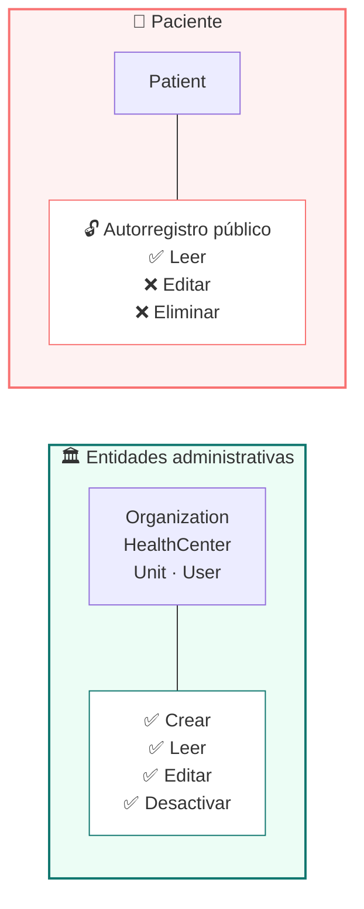
```mermaid
flowchart LR
    subgraph ADMIN["🏛️ Entidades administrativas"]
        direction TB
        A1["Organization<br/>HealthCenter<br/>Unit · User"]
        A2["✅ Crear<br/>✅ Leer<br/>✅ Editar<br/>✅ Desactivar"]
        A1 --- A2
    end

    subgraph PAC["🧏 Paciente"]
        direction TB
        B1["Patient"]
        B2["🔓 Autorregistro público<br/>✅ Leer<br/>❌ Editar<br/>❌ Eliminar"]
        B1 --- B2
    end

    style ADMIN fill:#ecfdf5,stroke:#0f766e,stroke-width:2px
    style PAC fill:#fef2f2,stroke:#f87171,stroke-width:2px
    style A2 fill:#ffffff,stroke:#0f766e
    style B2 fill:#ffffff,stroke:#f87171
```

Lo que sí puede hacer el personal autorizado es **consultar**, como demuestra la sección 8.3. La ficha del paciente es, para el sistema, un dato que se lee pero no se altera desde el panel administrativo.

---

## 9. Hito 2 — Código Temporal de Atención (CTA)

> 💡 **El problema que resuelve el CTA.** Un paciente sordo llega a urgencias y se acerca al mesón de Admisión. El funcionario necesita saber **quién es** para abrir su atención. Pero el paciente no puede decírselo hablando, y escribir su RUT en un papel es lento, propenso a errores y expone datos sensibles a la vista de la sala de espera.
>
> El **CTA** resuelve esto: el paciente genera en su propio teléfono un código corto (`SV-` + 6 dígitos), se lo muestra al funcionario, y ese código **revela la identidad del paciente** al sistema de Admisión.

### 9.1 La decisión de diseño más importante del hito

Antes de escribir una sola línea de código, el diseño original de este hito decía: *"Admisión genera el CTA para el paciente que tiene en pantalla, y luego lo valida"*. Ese planteamiento tenía una **contradicción lógica**:

> Si Admisión necesita tener al paciente ya identificado en pantalla para generar su código, entonces el código **no cumple ninguna función real** — la identificación ya ocurrió antes, por otro medio.

El diseño se corrigió al flujo inverso, que es el implementado:

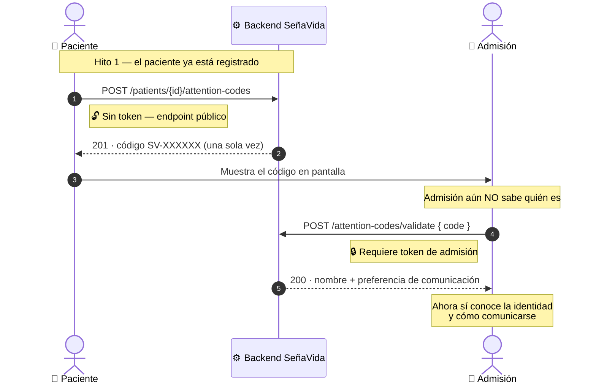
```mermaid
sequenceDiagram
    autonumber
    actor P as 🧏 Paciente
    participant API as ⚙️ Backend SeñaVida
    actor A as 🏥 Admisión

    Note over P,API: Hito 1 — el paciente ya está registrado

    P->>API: POST /patients/{id}/attention-codes
    Note right of P: 🔓 Sin token — endpoint público
    API-->>P: 201 · código SV-XXXXXX (una sola vez)

    P->>A: Muestra el código en pantalla
    Note over A: Admisión aún NO sabe quién es

    A->>API: POST /attention-codes/validate { code }
    Note left of A: 🔒 Requiere token de admisión
    API-->>A: 200 · nombre + preferencia de comunicación

    Note over A: Ahora sí conoce la identidad<br/>y cómo comunicarse
```

> **La lección de fondo:** el propósito de una credencial de identificación es **revelar** una identidad, no confirmarla. Si el sistema ya conoce la identidad antes de usar la credencial, la credencial está de más.

### 9.2 Parámetros de seguridad implementados

| Parámetro | Valor |
|---|---|
| Formato del código | `SV-` + 6 dígitos, comparación *case-insensitive* |
| Vigencia | **60 minutos** desde su generación |
| Reutilización | **Un solo uso** |
| Códigos activos por paciente | **Máximo 1** — generar uno nuevo invalida el anterior |
| Almacenamiento | **Nunca en claro**: se persiste su hash bcrypt |
| Generación del número | `random_int()` — generador criptográficamente seguro |
| Protección contra fuerza bruta | Límite de frecuencia por IP |

### 9.3 Generación del código (T3)

> **Endpoint:** `POST /api/v1/patients/{id}/attention-codes` — 🔓 **público, sin autenticación**
> **Qué demuestra:** que el paciente genera su propio código sin necesitar credenciales.

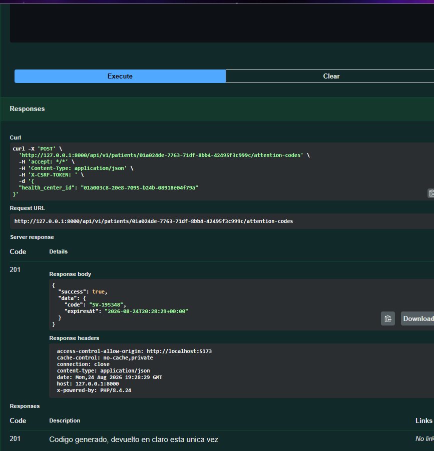

**Resultado obtenido:** `201 Created` con:

```json
{
  "code": "SV-195348",
  "expiresAt": "2026-08-24T20:28:29+00:00"
}
```

La petición se ejecutó a las `19:28:29 GMT` y el código expira a las `20:28:29` — exactamente **60 minutos** después, confirmando la vigencia configurada. Igual que en el autorregistro, el comando `curl` **no incluye header `Authorization`**.

> **El código en claro se devuelve una sola vez.** En la base de datos solo queda su hash bcrypt. Si el paciente pierde el código, no hay forma de recuperarlo — hay que generar uno nuevo. Es el mismo principio con el que se tratan las contraseñas.

### 9.4 Un solo código activo por paciente

> **Qué demuestra:** que generar un código nuevo invalida automáticamente el anterior.


**Resultado obtenido:** `201 Created` con un código **distinto**, `SV-940557`, generado a las `19:29:38` — apenas un minuto después del anterior.

Internamente, antes de insertar el registro nuevo, el sistema ejecuta:

```sql
UPDATE temporary_access_codes
SET status = 'expired'
WHERE patient_id = ? AND status = 'active'
```

El código `SV-195348` de la sección anterior quedó marcado como `expired` en ese instante, aunque su hora de expiración natural aún no había llegado.

**Comprobación en la práctica:**

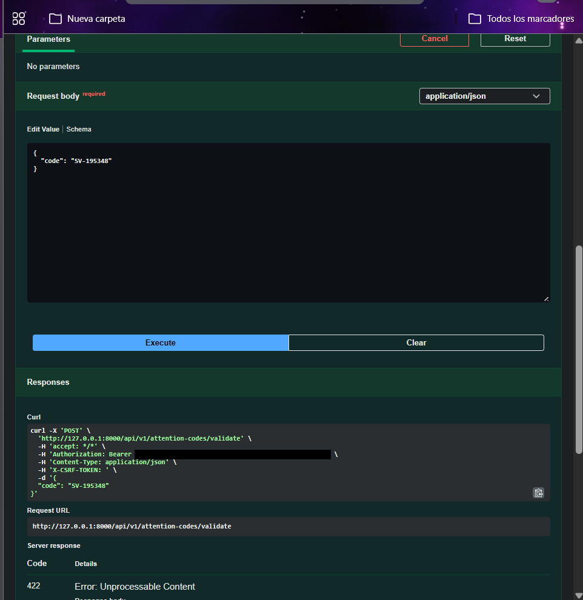

Al intentar validar `SV-195348` después de haber generado `SV-940557`, el sistema responde `422`. El rechazo **no ocurre porque el hash no coincida** — de hecho coincide perfectamente — sino porque el registro ya está en estado `expired`.

> 💡 **Por qué existe esta regla:** si un paciente pudiera tener varios códigos vivos a la vez, un código antiguo olvidado en una captura de pantalla o mostrado a la persona equivocada seguiría siendo utilizable. Con un solo código activo, generar uno nuevo cancela cualquier riesgo anterior.

### 9.5 Rechazo de código inválido

> **Endpoint:** `POST /api/v1/attention-codes/validate` — 🔒 requiere token de `admision`
> **Qué demuestra:** que un código inexistente es rechazado con un mensaje claro y sin filtrar información.


**Resultado obtenido:** `422 Unprocessable Content` con el mensaje `"El codigo ingresado no es valido."`.

Se envió `SV-000000`, un código que nunca existió. La respuesta es deliberadamente **genérica**: no revela si el código existió alguna vez, si expiró, o si pertenece a otro centro de salud. Cualquier detalle adicional sería información útil para alguien intentando adivinar códigos.

Debajo, Swagger documenta los códigos posibles de este endpoint: `200` (código válido, devuelve datos mínimos del paciente), `401` (no autenticado), `403` (sin permiso o código bloqueado por intentos).

### 9.6 Validación exitosa — el flujo completo ⭐

> **Qué demuestra:** el ciclo completo del CTA funcionando de punta a punta. **Esta es la evidencia central del Hito 2.**

**Paso 1 — el paciente genera su código:**

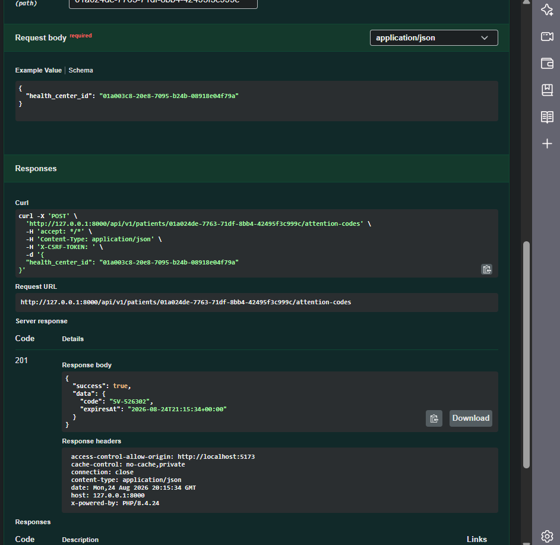

`201 Created` con el código `SV-526302`, válido hasta las `21:15:34`. Petición **sin token**.

**Paso 2 — Admisión valida el código:**


**Resultado obtenido:** `200 OK` con:

```json
{
  "accessId": "01a0356a-0157-72bf-a2a7-6ffa33a442be",
  "patient": {
    "id": "01a024de-7763-71df-8bb4-42495f3c999c",
    "name": "Juan Soto",
    "communicationPreference": "texto"
  }
}
```

**Aquí está el corazón del sistema.** El funcionario de Admisión escribió únicamente `{"code": "SV-526302"}` — no envió ningún `patient_id`, no seleccionó a nadie de una lista, no sabía de antemano quién era la persona frente a él. El sistema le **reveló** la identidad: se llama Juan Soto, y se comunica **por texto**.

Ese último dato no es un detalle administrativo: le dice al funcionario, antes de intentar nada, **cómo comunicarse con esta persona**. Es exactamente el propósito para el que existe SeñaVida.

> **Nota técnica sobre la validación sin `patient_id`.** Como el código se guarda con hash bcrypt, y bcrypt genera un hash distinto cada vez (por el *salt* aleatorio), **no se puede buscar directamente por hash** en la base de datos. La validación compara el código con `Hash::check()` contra los códigos `active` **del centro de salud del funcionario autenticado**. Ese acotamiento cumple, por construcción, la regla de aislamiento por centro: un funcionario del Hospital A no puede validar el código de un paciente que está en el Hospital B.

### 9.7 Protección contra fuerza bruta

> **Qué demuestra:** que el sistema bloquea intentos repetidos desde una misma IP.


**Resultado obtenido:** `429 Too Many Requests` con el mensaje `"Demasiados intentos. Intenta de nuevo en 584 segundos."`.

Tras varias generaciones consecutivas desde la misma dirección IP, el sistema cortó el acceso e indicó el tiempo exacto de espera restante.

**Límites configurados:**

| Endpoint | Límite |
|---|---|
| Generación de CTA | 5 intentos / 10 minutos por IP |
| Validación de CTA | 5 intentos / 5 minutos por IP |

> 💡 **Por qué la protección es por IP y no por contador en el registro.** El esquema incluye columnas `failed_attempts` y `max_attempts`, pero **no se incrementan por intento individual**. La razón es lógica: cuando alguien escribe un código que no coincide con ninguno, **no hay un registro específico al cual atribuir el fallo** — el sistema no sabe qué código "pretendía" escribir. Sumar el fallo a un registro arbitrario sería incorrecto.
>
> La protección se resolvió entonces en la capa adecuada: **límite de frecuencia por IP**, que cubre el mismo riesgo (adivinar códigos por fuerza bruta) sin necesitar identificar una víctima concreta. Un código de 6 dígitos tiene un millón de combinaciones; a 5 intentos cada 5 minutos, agotarlas tomaría más de 19 años — muy por encima de los 60 minutos de vigencia.

### 9.8 Lo que queda pendiente para el próximo hito

El contrato del proyecto define **tres** operaciones sobre el CTA. Dos están implementadas y documentadas arriba:

| # | Operación | Estado |
|---|---|---|
| **T3** | Generar el código | ✅ Implementado |
| **T1** | Validar el código | ✅ Implementado |
| **T2** | **Consumir** el código y abrir la atención | ⏭️ Diferido al Hito 3 |

**T2 se difirió deliberadamente**, no por falta de tiempo: la respuesta de ese endpoint *es* una **sesión médica** (`MedicalSession`), y ese modelo aún no existe. Construir el endpoint antes que el modelo que devuelve habría sido imposible. Se implementará junto con la entidad central del sistema, en el hito siguiente.

> **Validar y consumir son operaciones distintas a propósito.** Validar responde *"¿quién es esta persona?"* y puede repetirse. Consumir responde *"abramos su atención"* y ocurre **una sola vez**, marcando el código como usado. Separarlas permite que Admisión confirme la identidad antes de comprometerse a abrir una atención.

---

## 10. Estado actual de la base de datos

> **Qué demuestra:** que todas las tablas del sistema, incluidas las de los hitos nuevos, están efectivamente creadas en PostgreSQL.

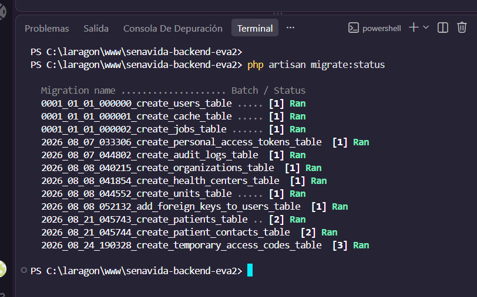

**Resultado obtenido:** las doce migraciones del proyecto figuran en estado **`Ran`**, sin ninguna pendiente ni fallida.

La columna **Batch** cuenta por sí sola la historia del proyecto:

| Batch | Migraciones | Corresponde a |
|:---:|---|---|
| **1** | `users`, `cache`, `jobs`, `personal_access_tokens`, `audit_logs`, `organizations`, `health_centers`, `units`, `add_foreign_keys_to_users_table` | Base de Laravel, Sanctum y módulo administrativo |
| **2** | `patients`, `patient_contacts` | **Hito 1** — Modelo de Paciente |
| **3** | `temporary_access_codes` | **Hito 2** — Código Temporal de Atención |

> **Qué es un *batch*:** cada vez que se ejecuta `php artisan migrate`, Laravel agrupa bajo un mismo número todas las migraciones aplicadas en esa corrida. Esto permite deshacer un grupo completo con `migrate:rollback` sin afectar los anteriores — y, como efecto secundario útil, deja registrado el orden cronológico real en que se construyó el sistema.

---

## 11. Cumplimiento de la rúbrica

Esta tabla resume cómo cada indicador de la rúbrica queda cubierto por las evidencias de este informe.

| Indicador de la rúbrica | Puntos | Evidencia en este informe | Estado |
|---|---|---|---|
| **1.** Conexión BD + configuración en `.env` + modelos | 33 | Sección 2 (`.env`, `about`, `migrate:status`) + Sección 5.1–5.7 (creación y listado de catálogos) + Sección 10 (estado actualizado) | ✅ |
| **2.** Login + middleware de autenticación | 34 | Sección 3 (login, `/me`, logout, rate limiting) + Sección 6.4 (ciclo completo desde Swagger) | ✅ |
| **3.** Registro de usuario con cifrado de contraseña | 33 | Sección 4 (registro 201 + hash `$2y$12$` en Tinker + control de duplicados) | ✅ |
| **TOTAL** | **100** | | ✅ |

### Evidencia adicional no exigida por la rúbrica

El trabajo documentado en este informe excede los tres indicadores mínimos. Las siguientes secciones documentan capas construidas después de la entrega base:

| Sección | Aporte |
|---|---|
| **5.4** | Control de acceso basado en roles (RBAC) sobre el registro de usuarios |
| **5.8** | Aislamiento por *multitenancy* entre centros de salud |
| **6** | Documentación OpenAPI 3.0 interactiva, generada desde el código |
| **7** | CRUD completo con borrado lógico y verificación de persistencia |
| **8** | Modelo de Paciente con autorregistro público y edad derivada |
| **9** | Código Temporal de Atención con hash, expiración, uso único y límite de frecuencia |
| **10** | Verificación del esquema completo en PostgreSQL |

---

## 12. Glosario rápido

Para quien lea este informe sin ser parte del proyecto (por ejemplo, un evaluador que quiera repasar los términos técnicos):

| Término | En palabras simples |
|---|---|
| **API REST** | Una forma estándar de organizar un backend para que hable en JSON con cualquier frontend, a través de rutas como `/api/v1/...` |
| **Endpoint** | Una "puerta" específica de la API — por ejemplo, `POST /api/v1/auth/login` es el endpoint del login |
| **Token Bearer** | Una especie de carnet digital temporal que el servidor entrega al hacer login, y que hay que "mostrar" (enviar en el header `Authorization`) en cada petición siguiente para probar quién eres |
| **Sanctum** | El paquete de Laravel que genera, valida y revoca esos tokens |
| **Hash (bcrypt)** | El resultado de cifrar un texto de forma irreversible — no se puede "descifrar" de vuelta al original, solo comparar si otro texto genera el mismo hash |
| **Salt** | Un valor aleatorio que bcrypt añade antes de cifrar, y que hace que el mismo texto produzca un hash distinto cada vez. Es lo que impide buscar directamente por hash en la base de datos |
| **Rate limiting** | Un límite de cuántas veces se puede intentar algo en un período de tiempo, para frenar ataques de fuerza bruta |
| **RBAC** (*Role-Based Access Control*) | Control de acceso basado en el rol del usuario: no todos los usuarios autenticados pueden hacer todo |
| **Multitenancy** | Que un mismo sistema sirva a varios "inquilinos" (aquí, hospitales) manteniendo sus datos completamente separados entre sí |
| **Migración** | Un archivo de código que describe cómo crear o modificar una tabla, de forma que el esquema completo se pueda reconstruir en cualquier máquina |
| **Batch** (en migraciones) | El número de grupo bajo el que Laravel registra las migraciones aplicadas en una misma ejecución |
| **Tinker** | La consola interactiva de Laravel para ejecutar código PHP directamente contra el proyecto y su base de datos |
| **Swagger / OpenAPI** | Un estándar para describir APIs, y la interfaz web que permite leer y **ejecutar** esos endpoints desde el navegador |
| **Policy** | Una clase de Laravel que concentra las reglas de "quién puede hacer qué" sobre una entidad, separadas del controlador |
| **Borrado lógico** (*soft delete*) | Marcar un registro como inactivo en vez de eliminarlo físicamente, preservando el historial y las relaciones |
| **Accessor** | Un método del modelo que calcula un valor al momento de leerlo, en vez de guardarlo en la base de datos — como la edad derivada de la fecha de nacimiento |
| **CTA** | Código Temporal de Atención. Credencial intransferible y de un solo uso con la que un paciente se identifica ante Admisión |
| **Sesión médica** | La atención clínica concreta de un paciente. **No** es lo mismo que la sesión de usuario del personal |

---

<p align="center">
  <sub>Informe de evidencias — Proyecto <strong>SeñaVida</strong> · Backend API REST · Instituto Profesional San Sebastián</sub><br/>
  <sub>Secciones 1–5: entrega EVA2 · Secciones 6–10: Fase 4, Hitos 1 y 2</sub>
</p>
